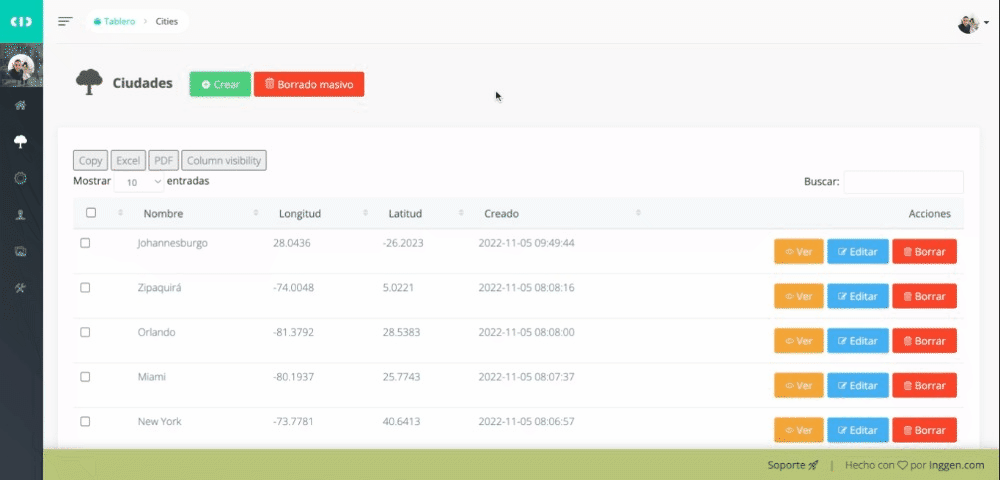

    

## Acerca de la prueba Browser Travel

Desarrollo creado para la prueba como desarrollador PHP Senior, de acuerdo a los requerimientos señalados:

DESARROLLADOR PHP SENIOR

Prueba práctica

Es necesario realizar una página donde se consulte la humedad de las ciudades Miami, Orlando y New York y se muestren en un mapa, adicionalmente tiene que almacenar en un historial que se pueda consultar a través de un link en la página.

Tener en cuenta:
Diseño Responsive

## Desarrollo

Se creó una aplicación web en la cual se puedan ir agregando las ciudades desde un sistema de gestión de contenidos personalizado, inicialmente se crearon las tres ciudades solicitadas, pero es posible crear las que sean requeridas, también se desarrolló teniendo en cuenta un sistema adaptable a cualquier dispositivo y se hace un registro de IP para control de solicitudes al crear el historial.

## Manual de usuario

1. Dar clic en ver el mapa y luego girar el mapa para buscar la ciudad de la cual quiere saber el clima y la humedad:

  

2. Al dar clic en la ciudad, la página baja automáticamente y muestra los datos para la ciudad seleccionada, al dar clic en "Ver mapa" la página sube para seleccionar otra ciudad:

  

3. Automáticamente el historial va quedando guardado en la parte inferior de la información del clima:

  

4. En el administrador de contenido podemos agregar otra ciudad, que no se encuentre registrada en la aplicación, debemos colocar el nombre de la ciudad y las coordenada geográficas de longitud y latitud:

  

5. Al dar clic en guardar, se muestra la información en la tabla del administrador:

  

6. La ciudad también queda actualizada en el front de la aplicación:

  

7. En el administrador del contenidos van quedando guardados todos los registros de las consultas lanzadas desde el front, es posible descargarlo en csv, Excel o PDF:

  